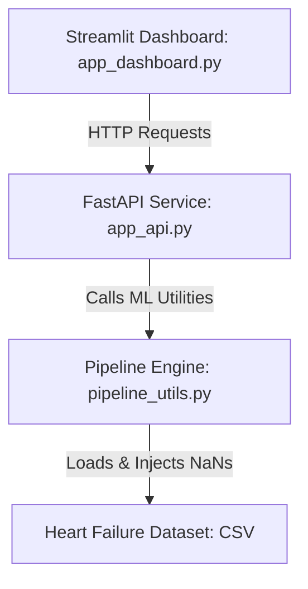

# SafeClinical: Medical Diagnostic Pipeline with Leakage Prevention 🛡️

SafeClinical is an interactive, production-ready machine learning application designed to demonstrate the critical importance of **Data Leakage Prevention** in clinical diagnostics. 

Built using a **FastAPI backend** and a premium, dark-themed **Streamlit dashboard**, the project models mortality risk in heart failure patients using clinical records, comparing a mathematically sound **Secure Preprocessing Pipeline** against a naive, **Leaky Preprocessing Flow** to highlight validation inflation.

---

## 📋 Table of Contents
1. [Core ML Concept: What is Data Leakage?](#-core-ml-concept-what-is-data-leakage)
2. [Project Architecture](#-project-architecture)
3. [Dataset & Features](#-dataset--features)
4. [Key Features of the Application](#-key-features-of-the-application)
5. [Installation & Setup](#-installation--setup)
6. [API Endpoint Reference](#-api-endpoint-reference)
7. [Detailed Preprocessing Workflows](#-detailed-preprocessing-workflows)

---

## 💡 Core ML Concept: What is Data Leakage?

In clinical machine learning, preparing medical records incorrectly leads to **Data Leakage**. This occurs when information from outside the training dataset (such as the validation fold or unseen test set) is accidentally exposed to the model during the training/preprocessing phase.

### 🚫 The Naive / Leaky Preprocessing Flow
1. **Global Imputation & Scaling**: Missing values are imputed (e.g., using the dataset-wide mean) and continuous features are scaled (e.g., using global mean and variance) across the **entire dataset** prior to splitting.
2. **Splitting**: The preprocessed data is then split into training and validation sets.
3. **The Flaw**: The training set contains embedded statistics from the validation fold. The validation set is no longer truly "unseen." This artificially inflates validation metrics (validation accuracy, precision, recall, F1) while yielding a model that fails on new clinical patients.

### 🛡️ The Secure Pipeline Flow
1. **Pipeline Wrapping**: The preprocessing stages (imputers, scalers, and encoders) are encapsulated inside a Scikit-Learn `Pipeline` together with the estimator.
2. **Strict Encapsulation**: During cross-validation or train-test splits, the preprocessing statistics (mean value for imputation, scale factors) are computed **solely from the training split** of that particular fold.
3. **Execution**: The validation fold is transformed strictly using the training fold's statistics, preventing any information leakage.

---

## 🛠️ Project Architecture

The codebase is modularized into three core layers:



- **[pipeline_utils.py](file:///c:/ibm%20prOJECT/pipeline_utils.py)**: Contains core logic for loading datasets, injecting missing values, defining preprocessing components, executing cross-validation, conducting holdout evaluations, and performing single-patient evaluations.
- **[app_api.py](file:///c:/ibm%20prOJECT/app_api.py)**: A FastAPI service exposing endpoints for data statistics, pipeline training & comparative analysis, and individual patient predictions. Caches the trained secure model.
- **[app_dashboard.py](file:///c:/ibm%20prOJECT/app_dashboard.py)**: A Streamlit frontend utilizing custom HTML/CSS for glassmorphism, rendering interactive charts (ROC curves, confusion matrices, pie charts), and serving as an educational hub.
- **[requirements.txt](file:///c:/ibm%20prOJECT/requirements.txt)**: Lists all library versions, including `scikit-learn`, `fastapi`, `streamlit`, `pandas`, `plotly`, and `uvicorn`.

---

## 📊 Dataset & Features

The project utilizes the **Heart Failure Clinical Records** dataset (`Heart_failure_clinical_records_dataset.csv`), containing 299 patients with 13 features. To simulate raw clinical records, **10% missing values (NaN)** are artificially injected into continuous columns (`serum_sodium`, `platelets`).

### Features Analysed:
- **Numerical Features** (`NUM_COLS`):
  - `age`: Patient age (years).
  - `creatinine_phosphokinase`: Level of the CPK enzyme in blood (mcg/L).
  - `ejection_fraction`: Percentage of blood leaving the heart at each contraction.
  - `platelets`: Platelets in the blood (kiloplatelets/mL) *(Contains 10% injected NaNs)*.
  - `serum_creatinine`: Level of serum creatinine in the blood (mg/dL).
  - `serum_sodium`: Level of serum sodium in the blood (mEq/L) *(Contains 10% injected NaNs)*.
  - `time`: Follow-up period in days.
- **Categorical Features** (`CAT_COLS`):
  - `anaemia`: Decrease of red blood cells or hemoglobin (0 = No, 1 = Yes).
  - `diabetes`: Patient has diabetes (0 = No, 1 = Yes).
  - `high_blood_pressure`: Patient has hypertension (0 = No, 1 = Yes).
  - `sex`: Gender (0 = Female, 1 = Male).
  - `smoking`: Patient smokes (0 = No, 1 = Yes).
- **Target Variable** (`DEATH_EVENT`):
  - `0`: Survived during the follow-up period.
  - `1`: Deceased during the follow-up period.

---

## ✨ Key Features of the Application

The Streamlit dashboard contains four specialized workspaces:

1. **💡 Data Leakage & Security**: Educational tab illustrating the flow of data leakage, explaining how validation inflation occurs, and displaying structural differences.
2. **📊 Dataset Statistics**: Displays dataset summaries, missing feature counts, correlations, and distribution pie charts.
3. **📈 Model Comparison**: Trains and compares models (Random Forest, Gradient Boosting, Logistic Regression) under secure and leaky settings. Renders comparative tables, difference charts, ROC curves, and side-by-side confusion matrices.
4. **🩺 Patient Risk Calculator**: An interactive diagnostic portal. Clinicians can input patient parameters (including missing values) to calculate mortality probability (Low, Moderate, High Risk) and view a step-by-step mathematical trace showing how values are imputed, scaled, encoded, and predicted.

---

## 🚀 Installation & Setup

Ensure Python 3.10+ is installed on your local machine.

### 1. Create a Virtual Environment and Install Dependencies
In your terminal, navigate to the project directory and execute:
```powershell
# Create venv
python -m venv venv

# Activate venv
# On Windows (PowerShell):
.\venv\Scripts\Activate.ps1
# On Linux/MacOS:
source venv/bin/activate

# Install requirements
pip install -r requirements.txt
```

### 2. Run the FastAPI Backend
Start the backend server on `http://127.0.0.1:8000`:
```powershell
python app_api.py
```
*(The backend runs on Uvicorn, which is configured to listen on port 8000 by default)*.

### 3. Run the Streamlit Dashboard
In a separate terminal (with the virtual environment activated), start the dashboard:
```powershell
streamlit run app_dashboard.py
```
Streamlit will automatically open the frontend in your default browser at `http://127.0.0.1:8501`.

---

## 🔌 API Endpoint Reference

The backend offers three primary HTTP endpoints:

### 1. `GET /data-info`
Reads the clinical records and returns data summaries.
- **Response Shape**:
  ```json
  {
    "total_records": 299,
    "columns": [...],
    "data_types": {...},
    "missing_values": {"serum_sodium": 30, "platelets": 29, ...},
    "class_distribution": {"0": {"count": 203, "percentage": 0.6789}, "1": {"count": 96, "percentage": 0.3211}},
    "summary_stats": {...}
  }
  ```

### 2. `POST /train`
Accepts preprocessing/model parameters, trains both models, and computes metric comparisons.
- **Request Body**:
  ```json
  {
    "estimator_type": "rf",
    "imputer_strategy": "mean",
    "scaling_method": "standard",
    "cv_folds": 5,
    "test_size": 0.2
  }
  ```
- **Response Shape**: Includes `secure_cv`, `leaky_cv`, `secure_holdout`, `leaky_holdout` metrics, ROC curve coordinate arrays, confusion matrices, and feature importances.

### 3. `POST /predict`
Processes a single patient's data through the active secure pipeline and generates predictions along with execution traces.
- **Request Body**: (Allows continuous variables to be `null` for missing records)
  ```json
  {
    "age": 65,
    "anaemia": 1,
    "creatinine_phosphokinase": 250,
    "diabetes": 0,
    "ejection_fraction": null,
    "high_blood_pressure": 1,
    "platelets": null,
    "serum_creatinine": 1.3,
    "serum_sodium": 135,
    "sex": 1,
    "smoking": 0,
    "time": 150
  }
  ```
- **Response Shape**: Contains imputed numerical variables, scaled values, encoded shapes, raw probabilities, final classifications, and prediction risk categories.

---

## 🧬 Detailed Preprocessing Workflows

The secure preprocessor uses a Scikit-Learn `ColumnTransformer` structured as follows:

```
ColumnTransformer
 ├── 'num' -> Pipeline(steps=[
 │             ('imputer', SimpleImputer(strategy=imputer_strategy)),
 │             ('scaler', StandardScaler() or MinMaxScaler())
 │           ]) -> applied to NUM_COLS
 └── 'cat' -> Pipeline(steps=[
               ('imputer', SimpleImputer(strategy='most_frequent')),
               ('onehot', OneHotEncoder(handle_unknown='ignore', sparse_output=False))
             ]) -> applied to CAT_COLS
```

When evaluating a new patient, the system traces the exact flow of data through this pipeline:
1. **Continuous Values Imputation**: Missing continuous features are filled using the training set's statistics (e.g., average value).
2. **Scaling**: Imputed inputs are standardized using train-set z-scores ($\mu$ and $\sigma$).
3. **Categorical Imputation & Encoding**: Missing categorical features are filled with the training set mode, and nominal variables are one-hot encoded.
4. **Model Prediction**: The resulting vector is passed to the classifier to output the survival probability.
